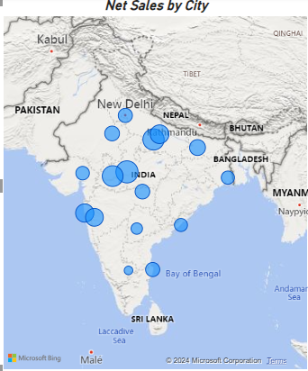
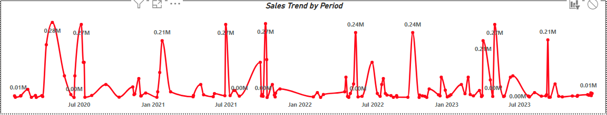
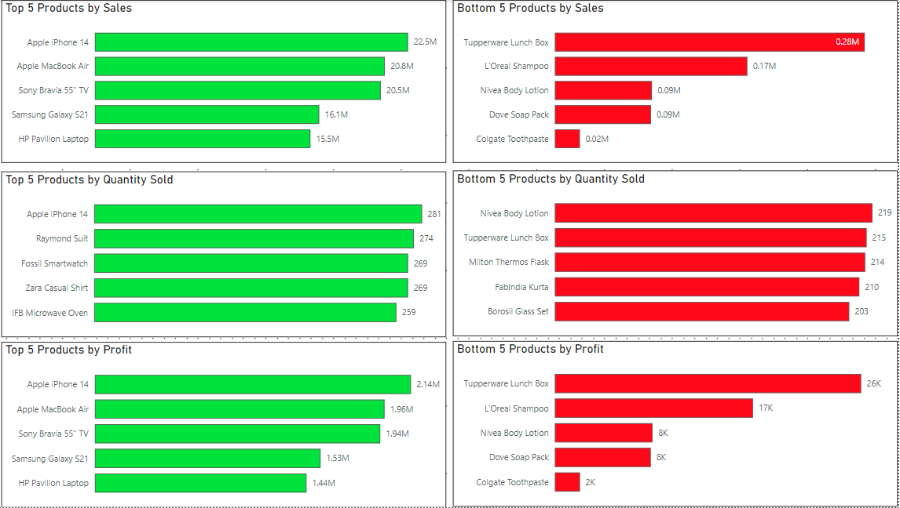

# Sales Data Analysis Report

## Overview
This Power BI report provides a comprehensive analysis of sales data, aimed at identifying key trends, performance metrics, and actionable insights. The report showcases data visualization, Power BI features, and data modeling skills.

## Objective
To analyze sales data for effective decision-making and to provide insights into sales performance, regional trends, product categories, and customer behavior.

## Dataset Summary
- **Key Columns**:
  - `Sales Amount`: Total sales revenue
  - `Product Category`: Category of the product sold
  - `Region`: Geographical region of sales
  - `Date`: Date of the transaction

## Key Insights
1. **Sales Trends**:
   - Monthly and yearly sales trends with peaks identified during specific quarters.
2. **Regional Performance**:
   - Top-performing regions contributing significantly to sales.
3. **Product Analysis**:
   - Insights into high-demand product categories and their contribution to overall revenue.
4. **Customer Segmentation**:
   - An analysis of customer segments, showing the highest revenue-generating segments.

## Skills and Tools Demonstrated
- **Power BI**: Used for data visualization and report creation.
- **Data Modeling**: Relationship building between tables.
- **DAX (Data Analysis Expressions)**: Custom calculations and metrics.
- **Data Visualization**: Interactive charts, filters, and drill-down features.

## Visuals
Below are snapshots of key visuals from the report:

1. **Sales by Region**
     

2. **Sales by Time**
     

3. **Top/Bottom Analysis**
     
